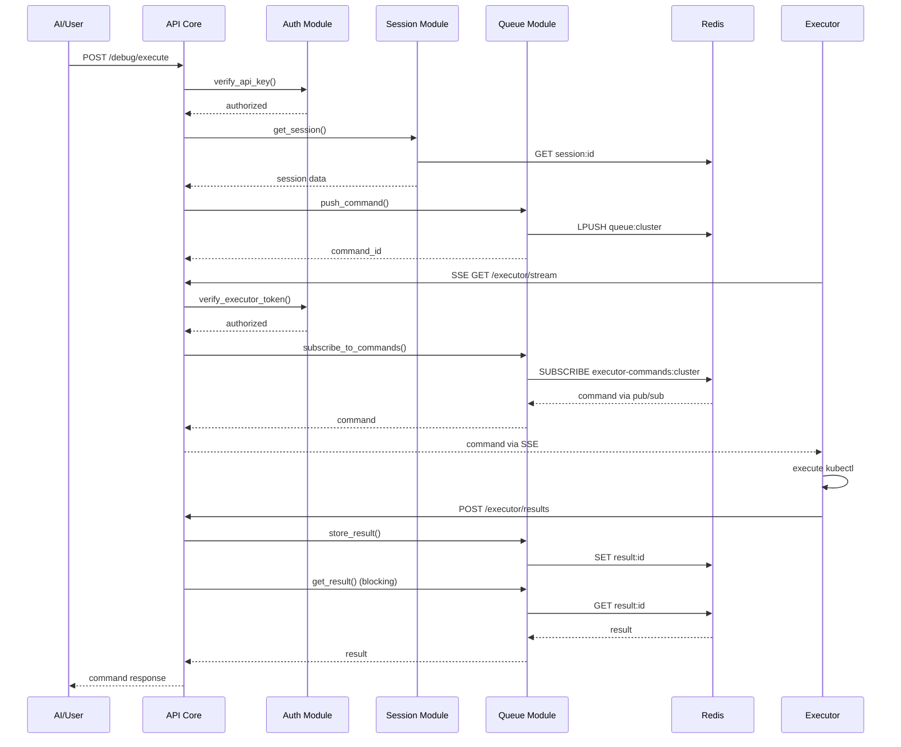

# Kubently Architecture Guide

## Table of Contents
- [Overview](#overview)
- [System Architecture](#system-architecture)
- [Component Design](#component-design)
- [Data Flow](#data-flow)
- [Security Architecture](#security-architecture)
- [Performance Architecture](#performance-architecture)
- [Integration Patterns](#integration-patterns)

## Overview

Kubently follows a modular, black-box architecture where each component exposes only its public interface while hiding implementation details. This design enables independent development, testing, and replacement of components without affecting the overall system.

### Design Principles

1. **Black Box Modules**: Each module exposes only its interface, hiding implementation
2. **Primitive-First**: Everything flows through three core primitives: Command, Session, and Result
3. **Single Responsibility**: Each module has one clear job that one person can maintain
4. **Interface Stability**: APIs remain stable even if implementations change completely
5. **Replaceable Components**: Any module can be rewritten using only its public API

## System Architecture

### High-Level Architecture

```
┌─────────────────────────────────────────────────────────────┐
│                        External Clients                      │
│          (AI Agents, CLI Tools, Multi-Agent Systems)        │
└─────────────────────────┬───────────────────────────────────┘
                          │ HTTPS
                          ▼
┌─────────────────────────────────────────────────────────────┐
│                      Kubently API Layer                      │
│  ┌──────────┐  ┌──────────┐  ┌──────────┐  ┌──────────┐   │
│  │   Auth   │  │ Session  │  │  Queue   │  │   Core   │   │
│  └──────────┘  └──────────┘  └──────────┘  └──────────┘   │
└────────────────────────┬────────────────────────────────────┘
                         │ Redis Protocol
                         ▼
┌─────────────────────────────────────────────────────────────┐
│                         Redis Store                          │
│         (Sessions, Command Queues, Results, State)          │
└─────────────────────────────────────────────────────────────┘
                         ▲
                         │ HTTP Long Polling
┌────────────────────────┴────────────────────────────────────┐
│                      Kubently Agents                         │
│  ┌──────────────┐  ┌──────────────┐  ┌──────────────┐     │
│  │   Agent 1    │  │   Agent 2    │  │   Agent N    │     │
│  │ (Cluster A)  │  │ (Cluster B)  │  │ (Cluster X)  │     │
│  └──────────────┘  └──────────────┘  └──────────────┘     │
└─────────────────────────────────────────────────────────────┘
```

### Component Responsibilities

| Component | Purpose | Interface | Hidden |
|-----------|---------|-----------|---------|
| **API Core** | HTTP routing and orchestration | REST endpoints | Request handling, error responses |
| **Auth** | Validate tokens and API keys | `verify_*()` functions | Token storage, validation logic |
| **Session** | Manage debugging lifecycle | `create/get/end_session()` | Storage, TTL management |
| **Queue** | Command queuing and delivery | `push/pop_command()` | Queue implementation, blocking logic |
| **Executor** | Execute kubectl commands | HTTP endpoints | kubectl execution, retry logic |
| **Models** | Define system primitives | Data structures | Serialization details |

## Component Design

### API Core Module

The API Core acts as the orchestrator, routing requests to appropriate modules without implementing business logic itself.

```python
# Public Interface
POST /debug/session     → session.create()
POST /debug/execute     → queue.push() + queue.get_result()
GET  /executor/stream   → SSE connection for executors
POST /executor/results  → queue.store_result()
GET  /health           → health_check()
```

### Authentication Module

Implements a simple but secure token-based authentication system.

```python
# Public Interface
verify_api_key(key: str) → bool
verify_agent_token(token: str, cluster_id: str) → bool
create_agent_token(cluster_id: str) → str

# Hidden Implementation
- Token storage mechanism
- Validation algorithms
- Key rotation logic
```

### Session Module

Manages the lifecycle of debugging sessions with automatic expiration.

```python
# Public Interface
create_session(cluster_id, user_id) → Session
get_session(session_id) → Session
end_session(session_id) → bool
is_session_active(cluster_id) → bool

# Hidden Implementation
- Redis key management
- TTL handling
- Session state transitions
```

### Queue Module

Handles command distribution and result collection using Redis for persistence.

```python
# Public Interface
push_command(command: Command) → str
pop_command(cluster_id: str, wait: int) → List[Command]
store_result(result: CommandResult) → bool
get_result(command_id: str, wait: int) → CommandResult

# Hidden Implementation
- Redis BLPOP for blocking operations
- Queue prioritization
- Result expiration
```

### Executor Module

Completely independent component that could be rewritten in any language.

```python
# Public Interface (HTTP)
GET  /executor/stream   → SSE connection for commands
POST /executor/results  → Store execution result

# Hidden Implementation
- kubectl subprocess management
- Command validation
- Error handling and retries
- SSE connection management
```

## Data Flow

### Command Execution Flow



### Session Activity Flow

During active debugging sessions, the system automatically adjusts polling rates:

1. **Session Created**: Cluster marked as "active" with 5-minute TTL
2. **SSE Connection**: Executor maintains persistent connection for instant delivery
3. **Command Received**: Executor executes immediately (< 50ms delivery)
4. **Session Idle**: Connection maintained but no commands sent
5. **Session Ended**: Explicit termination or TTL expiration

## Security Architecture

### Defense in Depth

```
Layer 1: API Gateway
├── Rate limiting per API key
├── Request validation
└── TLS termination

Layer 2: Authentication
├── API key validation for clients
├── Unique tokens per agent
└── Service identity tracking

Layer 3: Command Validation
├── Whitelist of kubectl verbs
├── Argument filtering
└── Namespace restrictions

Layer 4: Kubernetes RBAC
├── Read-only ClusterRole
├── ServiceAccount per agent
└── No write permissions

Layer 5: Network Isolation
├── Agents: outbound only
├── API: internal network
└── Redis: private subnet
```

### Security Boundaries

- **API ↔ Client**: Bearer token authentication
- **API ↔ Executor**: Cluster-specific token + ID verification
- **Executor ↔ Kubernetes**: ServiceAccount with minimal RBAC
- **API ↔ Redis**: Network isolation + optional AUTH

## Performance Architecture

### Optimization Strategies

1. **Server-Sent Events**: Real-time command streaming with ~50ms latency
2. **Redis Pub/Sub**: Instant command distribution to correct executor
3. **Persistent Connections**: Single SSE connection per executor
4. **Connection Pooling**: Reused HTTP and Redis connections
5. **Minimal Processing**: Direct command passthrough, no transformation

### Performance Characteristics

| Operation | Latency | Throughput |
|-----------|---------|------------|
| Session Creation | < 50ms | 1000/sec |
| Command Queue | < 10ms | 5000/sec |
| Command Execution | < 300ms | 100/sec/cluster |
| Result Retrieval | < 20ms | 2000/sec |
| Long Poll (idle) | 30s | N/A |
| Long Poll (active) | < 100ms | 1000/sec |

### Scaling Patterns

```yaml
# Horizontal Scaling
API Replicas: 2-10 pods (stateless)
Redis: Single instance or cluster mode
Executors: 1 per cluster (no scaling needed)

# Vertical Scaling
API: 500MB-2GB RAM, 0.5-2 CPU
Redis: 1GB-4GB RAM (based on sessions)
Executor: 100MB-256MB RAM, 0.1 CPU
```

## Integration Patterns

### Multi-Agent System (MAS) Integration

Kubently exposes MCP-compatible tools for agent-to-agent communication:

```python
# MCP Tool Registration
tools = [
    {
        "name": "create_debug_session",
        "parameters": {
            "cluster_id": "string",
            "correlation_id": "string"
        }
    },
    {
        "name": "execute_kubectl",
        "parameters": {
            "session_id": "string",
            "command": "string",
            "timeout": "integer"
        }
    }
]
```

### A2A Communication Pattern

```http
POST /debug/execute HTTP/1.1
X-API-Key: mas-orchestrator:key123
X-Correlation-ID: trace-abc-123
X-Service-Identity: orchestrator
X-Request-Timeout: 30

{
    "cluster_id": "production",
    "command_type": "get",
    "args": ["pods", "-n", "critical"],
    "correlation_id": "trace-abc-123"
}
```

### Webhook Pattern (Future)

For long-running operations in A2A scenarios:

```python
# 1. Immediate response with operation ID
POST /debug/execute/async
Response: {"operation_id": "op-123", "status": "pending"}

# 2. Webhook callback when complete
POST https://callback.url/webhook
{
    "operation_id": "op-123",
    "status": "completed",
    "result": {...}
}
```

## Module Dependency Graph

```
                    ┌────────┐
                    │ Models │ (No dependencies)
                    └───┬────┘
                        │
        ┌───────────────┼───────────────┐
        ▼               ▼               ▼
   ┌────────┐      ┌────────┐     ┌────────┐
   │  Auth  │      │Session │     │ Queue  │
   └────────┘      └────────┘     └────────┘
        │               │               │
        └───────────────┼───────────────┘
                        ▼
                  ┌──────────┐
                  │ API Core │ (Orchestrates)
                  └──────────┘

   ┌─────────┐
   │Executor│ (Completely independent)
   └─────────┘
```

## Error Handling Strategy

### Error Categories

1. **Client Errors (4xx)**
   - Invalid input: 400 Bad Request
   - Authentication: 401 Unauthorized
   - Not found: 404 Not Found
   - Rate limited: 429 Too Many Requests

2. **Server Errors (5xx)**
   - Redis unavailable: 503 Service Unavailable
   - Agent timeout: 504 Gateway Timeout
   - Internal error: 500 Internal Server Error

3. **Executor Errors**
   - Command validation failure
   - kubectl execution error
   - Network connectivity issues

### Error Response Format

```json
{
    "error": "Human-readable error message",
    "details": {
        "code": "ERROR_CODE",
        "context": {...}
    },
    "request_id": "req-abc-123",
    "timestamp": "2024-01-01T12:00:00Z"
}
```

## Monitoring and Observability

### Key Metrics

- **API Metrics**: Request rate, latency, error rate
- **Queue Metrics**: Queue depth, processing time
- **Session Metrics**: Active sessions, session duration
- **Executor Metrics**: Command execution time, success rate
- **Redis Metrics**: Connection pool, memory usage

### Health Checks

```python
GET /health
{
    "status": "healthy",
    "redis": "connected",
    "version": "1.0.0",
    "uptime_seconds": 3600,
    "active_sessions": 5
}
```

## Future Architecture Considerations

### Planned Enhancements

1. **WebSocket Support**: Real-time bidirectional communication
2. **Event Streaming**: Server-sent events for command results
3. **Multi-Cluster Routing**: Single API managing multiple clusters
4. **Caching Layer**: Redis-based response caching
5. **Metrics Pipeline**: Prometheus/Grafana integration

### Scalability Path

- **Phase 1**: Current - Single API, multiple agents
- **Phase 2**: API clustering with shared Redis
- **Phase 3**: Regional deployment with geo-routing
- **Phase 4**: Edge agents with local caching
